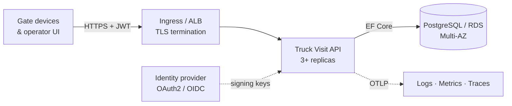
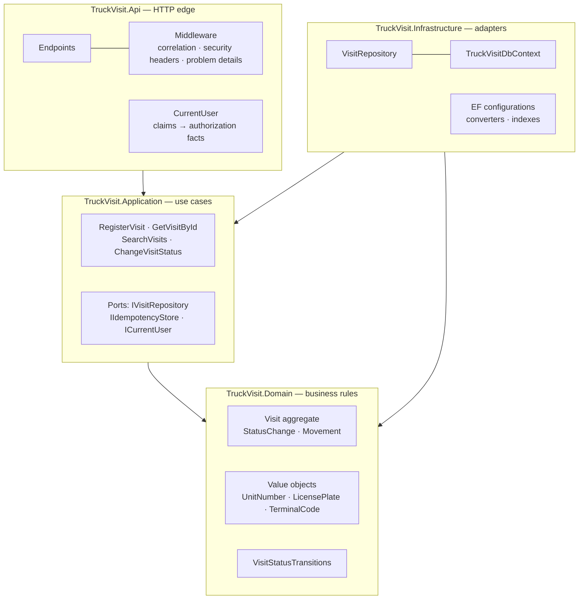
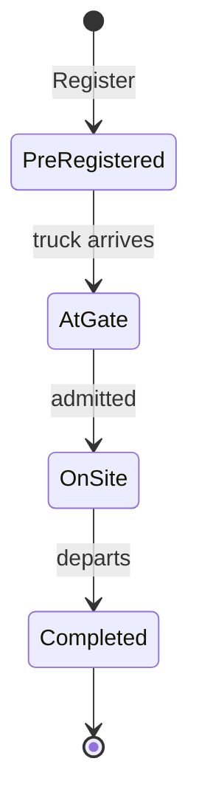

# Truck Visit Management API — Architecture

## 1. Context

Gate management at a large terminal needs near real-time visibility of trucks arriving to collect
and deliver cargo. This service records a **visit** — one truck's arrival at one terminal — and the
lifecycle it passes through, keeping every status change for seven years so that regulatory audits
can reconstruct what happened and when.

Three requirements shape every decision below:

| Requirement | Consequence |
|---|---|
| Full audit history of status changes, retained 7 years | Immutability is a structural property, not a convention |
| Up to 20 000 visits/day, peaks of 300 req/s | The system is overwhelmingly **read**-dominated |
| Expansion to multiple terminals without redesign | `TerminalId` is a tenancy boundary from day one |

---

## 2. What the numbers actually mean

The stated figures are small in write terms and large in storage terms. Reading them the other way
round produces the wrong architecture, so they are worked through here first.

**Write load.** 20 000 visits/day is **0.23 writes per second** on average. Even at a 10× peak-hour
concentration, writes stay in the low single digits per second. Write throughput is a non-problem.

**Read load.** The 300 req/s peak is therefore almost entirely reads: operator screens polling the
search endpoint. The system is read-dominated by roughly three orders of magnitude.

**Storage over the retention period.**

| Table | Rows at 7 years | Assumption | Approx. size incl. indexes |
|---|---|---|---|
| `visits` | ~51 M | 20 000/day × 365 × 7 | ~30 GB |
| `visit_status_history` | ~204 M | ~4 entries per visit | ~35 GB |
| `visit_movements` | ~77 M | ~1.5 movements per visit | ~18 GB |
| **Total** | | | **~85 GB** |

That is comfortably inside a single managed PostgreSQL instance. Storage volume is a
**query-planning** problem, not a capacity problem: 51 M rows demands correct indexes, not
sharding.

**Availability.** 99.95% permits ~4.4 hours of downtime per year — about 22 minutes a month. That
budget is consumed by ordinary deploys and node replacements long before any incident, which is why
the deployment runs three replicas with `maxUnavailable: 0` rather than one.

**Conclusion:** a correctly indexed, well-bounded single service. Not a distributed system.

---

## 3. High-level architecture

The API is a single deployable unit with clear internal module boundaries — a **modular monolith**.
Section 9 explains why, and what would have to change for that to stop being the right answer.

### Internal structure

Dependencies point inward only. `TruckVisit.Domain` and `TruckVisit.Application` have **zero NuGet
package references** — if either ever grows an `<ItemGroup>`, a business rule has leaked into a
framework.

---

## 4. Domain model

Forward-only, no skipping, `Completed` terminal. The case does not specify this — see
[assumptions](ASSUMPTIONS-AND-TRADEOFFS.md#a1-lifecycle-shape).

**`Visit`** is the aggregate root and the only way to change anything about a visit. Every
collection is exposed through `AsReadOnly()`, every property setter is private, and there is
exactly one code path that appends to the audit trail — one that cannot run without first
validating the transition.

**`StatusChange`** has no public setter and no mutating member. Its `Sequence` field gives the
trail a total order that cannot tie, because timestamps can collide within a millisecond and clocks
can be stepped backwards.

**Value objects** (`UnitNumber`, `LicensePlate`, `TerminalCode`, `LocationCode`) normalise at
construction: whitespace stripped, upper-cased with the **invariant** culture. This is the
acceptance criterion about capitalisation, implemented once where no call site can forget it. It is
also a correctness guard — see §7.

---

## 5. API design

| Method | Route | Success | Notes |
|---|---|---|---|
| `POST` | `/api/visits` | 201 / 200 | `Idempotency-Key` header supported; 200 on replay |
| `GET` | `/api/visits/{id}` | 200 | Full detail with complete audit trail |
| `GET` | `/api/visits` | 200 | 8 filters + pagination with metadata |
| `PATCH` | `/api/visits/{id}/status` | 200 | Not in the task list; added — see assumptions |
| `GET` | `/health/live`, `/health/ready` | 200 | Anonymous |

**Errors** are RFC 9457 `application/problem+json`, produced in exactly one place
(`GlobalExceptionHandler`). Endpoints contain no `try`/`catch` and no validation, so the same rule
violation cannot return 400 from one route and 500 from another.

| Condition | Status |
|---|---|
| Value fails a domain rule | 400 + `field` |
| Caller holds no claim for the terminal (write) | 403 |
| Visit absent, **or** at an invisible terminal | 404 |
| Illegal transition, or concurrent modification | 409 |
| Anything unrecognised | 500, no detail |

**Replay returns 200, not 201.** A client retrying over a flaky link needs to distinguish "I
created this" from "this already existed"; returning 201 twice hides a real failure mode.

**Search returns summaries, not full aggregates.** A list view needs current state, not every
transition that led to it. Returning history would multiply rows read per page by trail length —
on the busiest endpoint in the system.

---

## 6. Data storage

**PostgreSQL via EF Core.** Chosen because the audit trail is inherently relational, the search
endpoint filters across eight columns and two tables, status transitions need ACID guarantees, and
~85 GB sits well inside one managed instance. AWS RDS runs it natively.

### Schema

| Table | Purpose |
|---|---|
| `visits` | Aggregate root; `Truck` and `Driver` inlined as owned value objects |
| `visit_movements` | Owned collection; collections and deliveries |
| `visit_status_history` | Owned collection; **append-only** |
| `idempotency_records` | Composite key `(Key, UserId)` |

**Enums and value objects are stored as text.** These rows outlive the code that wrote them by
years. `AtGate` is still legible to an auditor in 2033; a bare `2` is legible only next to a copy of
this enum.

### Immutability — enforced three times

1. **Type level.** `StatusChange` exposes no setter and no mutating method. A unit test asserts
   this by reflection, so adding one fails the build.
2. **Persistence level.** `SaveChanges` inspects the change tracker and throws if any audit entry
   is `Modified` or `Deleted` — catching attached graphs and bulk operations that bypass the model.
3. **Database level.** The migration installs a `BEFORE UPDATE OR DELETE` trigger on
   `visit_status_history` that raises an exception, so a direct SQL statement is refused too. A
   trigger rather than a `REVOKE`, because `REVOKE` does not constrain a superuser and the owning
   role usually is one — the guarantee has to hold for every connection, not just the polite ones.
   `REVOKE` is still applied to the application role in production as a second layer.

Defence in depth is warranted here because this table is what a regulatory audit actually inspects.

### Indexes

| Index | Serves |
|---|---|
| `ix_visits_terminal_status_created` | The dominant query: one terminal, a status, ordered by recency |
| `ix_visits_terminal_created` | "Everything at this terminal today" |
| `ix_visits_created_by` | `createdBy` filter |
| `visit_movements(From)`, `(To)`, `(UnitNumber)` | `movementFrom` / `movementTo` filters |
| `visit_status_history(VisitId, Sequence)` unique | Ordering, and refusing a duplicated append |

Every visit index **leads with `TerminalId`**. That is deliberate: it makes the tenancy boundary a
physical property of the access path, not only a `WHERE` clause someone must remember.

### Concurrency

PostgreSQL's `xmin` system column as an optimistic concurrency token — no extra column, no extra
storage, no application code to maintain. Two gate terminals advancing the same visit simultaneously
produce a 409 for the second, not a lost update.

There are in fact **two** mechanisms, and which one fires is an implementation detail the caller
should never see. Both gates compute the next audit sequence number from the history they loaded,
so both attempt to insert the same one; EF sends that `INSERT` before the `UPDATE` that would have
tripped the concurrency token, and the unique index on `(VisitId, Sequence)` rejects it first. The
repository therefore translates *both* failures into the same domain-level conflict.

That was not designed in advance — it was found by the integration test that runs the race against
a real database. Written expecting only the concurrency exception, it failed, and without the fix
an ordinary race at a busy gate would have reached the client as a 500 instead of a 409. It is the
clearest argument in this repository for testing persistence against the real engine rather than an
in-memory substitute: no amount of unit testing against a fake repository could have produced it.

### Retention and growth

Seven years of history is a lifecycle problem, and the plan is documented rather than built:

- **Partition `visits` and `visit_status_history` by month on `CreatedTime`.** Operator queries
  touch recent data, so the planner prunes to one or two partitions regardless of total volume.
- **Tier storage.** Partitions older than ~18 months move to cheaper storage or export to S3 in
  Parquet for the analytics path; audits of old data are rare and may be slower.
- **Prune `idempotency_records`** after ~7 days. Retries are not plausible beyond that.
- **Driver data is personal data** under a 7-year retention rule, which is squarely in GDPR scope.
  The lawful basis is the terminal's own security and customs obligations; an erasure request is
  handled by pseudonymising the driver columns while leaving the audit chain structurally intact.

---

## 7. Security model

**Authentication.** OAuth2 / JWT Bearer. Settings bind from `Authentication:Schemes:Bearer`, which
is also where `dotnet user-jwts` writes — local development therefore uses **real, signed tokens**
and the pipeline contains no developer-only bypass, which is the shortcut that quietly ships.

**Authorization.** A fallback policy requires an authenticated user on every endpoint, so a route
added later is protected by default rather than by the author remembering. Terminal access comes
from `terminal` claims; `scope=terminals.all` grants cross-terminal read for auditors.

Claims pass through the same `TerminalCode` value object as stored data. Without that, a token
issued as `"dover "` would silently fail to match rows saved as `"DOVER"`, and an operator would be
told there are no trucks at their own terminal.

**Row scoping is resolved in the application layer**, before the repository, which therefore never
reasons about authorization. An empty terminal scope is handled explicitly and returns an empty
page — never all rows.

### A second, independent gate: PostgreSQL row-level security

The paragraph above is one gate, and it only holds for connections that go through this codebase.
The `TenantIsolationWithRowLevelSecurity` migration adds the other one, directly in the database, on
the same reasoning the append-only trigger already argues for immutability (ADR-003): a guarantee
that depends on application code remembering to apply a filter is not a guarantee.

- **A restricted runtime role.** `truckvisit_app` is `NOLOGIN` — nothing ever connects as it
  directly. `TruckVisitDbContext` always authenticates as the schema's owning role, because
  migrations need that role's DDL privileges, and `TenantScopeConnectionInterceptor` switches every
  connection opened for an authenticated caller into `truckvisit_app` with `SET ROLE`, immediately
  after telling the session which terminals that caller may see. Row-level security exempts a
  table's owner by default; the owning role never runs application queries, only DDL, so the
  exemption never matters for the traffic RLS exists to constrain.
- **Two session variables the policies read back.** `app.current_terminals` (comma-joined — a
  `TerminalCode`'s charset excludes the delimiter, so no claim can smuggle a second one in) and
  `app.terminals_all_scope`, for the same cross-terminal auditor case `HasGlobalTerminalAccess`
  already covers at the application layer.
- **Fails closed.** The policies read those variables with `current_setting(..., true)`, which
  returns `NULL` instead of raising when a session never set them — a raw psql session, a
  migration, a background job. `NULL` compared against anything is `NULL`, not `TRUE`, so a
  connection that never opts into a scope sees nothing, never everything.
- **`FORCE ROW LEVEL SECURITY`** on all three tables, so the one operational mistake that would
  otherwise defeat this — the owning connection being reused directly, without ever switching role
  — is bound by the same policies too, rather than silently exempt.
- **State is re-established on every connection open, never assumed to survive from the last one.**
  Two reasons, either sufficient alone: Npgsql pools physical connections, and nothing guarantees a
  role switch or a session variable survives being handed back out; and one physical connection
  legitimately serves different callers over its life — an operator, then the anonymous health
  check, then perhaps a background scope with none. Whichever this open is for, its state is set
  fresh, never inherited (`TenantScopeConnectionInterceptor`).
- **Privileges, not just visibility.** `truckvisit_app` is granted no `DELETE` on `visits` or
  `visit_movements` — nothing in the application deletes either — and no `UPDATE` or `DELETE` at
  all on `visit_status_history`. That is the same guarantee the append-only trigger gives,
  enforced twice, and it is what finally makes the "REVOKE is applied to the application role in
  production" line further up literally true rather than aspirational, closing a gap this
  document used to list as missing (`TenantIsolationTests`, proceeding the same way
  `AuditTamperDetectionTests` proves the trigger: assume every application-layer guard is absent,
  and show the database refuses anyway).
- **A write behaves exactly like a read that finds nothing.** A targeted `UPDATE` against a row
  outside the caller's scope is permitted by grant, and touches zero rows — indistinguishable from
  targeting a row that does not exist at all. That is the same 404-not-403 choice already made for
  reads (below), arrived at independently, because it is how PostgreSQL's row security behaves by
  default rather than something this codebase had to build.

`idempotency_records` deliberately carries no policy — a replayed request is deduplicated by
`(Key, UserId)`, not by terminal, and the table carries no `TerminalId` to scope by.

One sharp edge, documented rather than discovered later: `FORCE` means the owning role is bound by
these policies too, so an owner-role connection that ever queried `visits` directly — nothing in
this codebase does today — would see zero rows rather than every row, because its session set no
scope and the policy fails closed. And the migration grants role membership to a role literally
named `truckvisit`, which matches local development; a production database whose migration-owner
role has a different name needs the equivalent `GRANT truckvisit_app TO <that role>;` run once,
by hand, alongside the migration.

**404 vs 403.** A visit at an invisible terminal is reported as missing. Returning 403 would make
the endpoint an oracle: anyone with a token could enumerate identifiers and learn which visits exist
at terminals they have no right to know about. Writes return 403, where hiding existence buys
nothing.

**`createdBy` is never taken from the request body.** It comes from the authenticated principal's
`sub` claim. An audit trail attributed by the caller is not an audit trail.

**Transport and headers.** HSTS and HTTPS redirection outside Development; `X-Content-Type-Options`,
`X-Frame-Options: DENY`, `Referrer-Policy: no-referrer`, a `default-src 'none'` CSP, a restrictive
`Permissions-Policy`, and the `Server` header removed.

**Secrets.** Nothing is committed. Connection strings arrive as `ConnectionStrings__TruckVisit` from
the environment, wired to AWS Secrets Manager in a cluster. Start-up fails fast if absent.

**Error bodies leak nothing.** Unrecognised exceptions return a fixed message and a correlation id.
An exception message can name a table, a column, a host, or a connection string.

### Supply chain

`NuGetAudit` is enabled at `low` severity in `all` mode, and warnings are errors — so a known
vulnerability in **any** dependency, direct or transitive, fails the build. Three transitive
advisories were found during development and pinned forward rather than suppressed:

| Package | Was | Now | Advisory |
|---|---|---|---|
| `Microsoft.OpenApi` | 2.0.0 | 2.12.2 | GHSA-v5pm-xwqc-g5wc |
| `System.Security.Cryptography.Xml` | 9.0.0 | 10.0.12 | GHSA-23rf-6693-g89p + 7 others |
| `SSH.NET` | 2024.2.0 | 2026.0.0 | GHSA-mggc-4xg6-vcxf + 1 |

### The culture trap

`ToUpperInvariant`, not `ToUpper`. Under a Turkish locale the default upper-casing maps `i` to `İ`
(U+0130), not `I`. A server running under `tr-TR` would store the same plate differently from an
identical server under `en-GB`: two unmatchable records for one truck, and an audit trail that
cannot be joined back together.

`InvariantGlobalization` is deliberately **not** enabled — that would mask the problem rather than
solve it, leaving culture-sensitive calls in place to start corrupting data the day the switch was
flipped. Instead, CA1304/CA1305/CA1310 are build **errors**, and a unit test runs under `tr-TR` to
prove the behaviour.

---

## 8. Observability

| Requirement | Implementation |
|---|---|
| Structured logging | JSON to stdout with scopes; no string interpolation — `[LoggerMessage]` source generation keeps templates queryable |
| Correlation IDs | `X-Correlation-ID` honoured from the client, bounded and stripped of control characters, echoed on every response including errors |
| API throughput & latency | ASP.NET Core's built-in `http.server.request.duration` histogram |
| Business metrics | `truckvisit.visits.registered`, `.status_changed`, `.transition_rejected` |
| Audit logging | The `visit_status_history` table is the audit log — queryable, retained, immutable |
| Health checks | `/health/live` (no dependencies) and `/health/ready` (database reachable) |
| Error tracking | One handler, one mapping; known failures at information level, unknown at error with full context |

**Why liveness and readiness are separate.** A pod that cannot reach the database should be pulled
out of the load balancer, not restarted — restarting will not bring the database back, and a restart
loop across every replica during an RDS failover turns a brief outage into a total one.

**Why `transition_rejected` is worth a counter.** A rise means a gate device is out of step with the
server — a fault no HTTP metric reveals, because every one of those requests is a perfectly healthy
409.

---

## 9. Scalability

**Today.** Three stateless replicas behind an ingress; horizontal scaling to 12 on CPU. 300 req/s
across three replicas is 100 req/s each against indexed queries returning ≤200 rows — well inside a
single instance's capacity. PostgreSQL sees a negligible write rate and an indexed read rate it
handles on modest hardware.

### Measured, not estimated

The paragraph above is arithmetic. `tools/capacity/seed.sql` and `tools/capacity/explain.sql` exist
so it doesn't have to be taken on trust: the seed builds 1,000,000 visits — about 2% of the ~51
million seven-year estimate two sections down — with 1,000,000 movements and 3,000,000 audit
entries (1526 MB total), deliberately pessimistic: random UUID keys rather than the time-ordered
ones the application actually generates, and no skew across terminal or status. `explain.sql` then
runs the seven query shapes the API issues, with `EXPLAIN (ANALYZE, BUFFERS)`. Full output is
committed nowhere on purpose — it's a thousand lines of query plan — but here is every number from
it:

| # | Query | Plan | Execution time |
|---|---|---|---|
| 1 | Dominant query: one terminal, one status, recent-first | Index Scan Backward, `ix_visits_terminal_status_created` | **1.06 ms** |
| 2 | The paging count that accompanies it | Index Only Scan, same index | **60.3 ms** |
| 3 | One terminal, a date window | Index Scan Backward, `ix_visits_terminal_created` | **0.53 ms** |
| 4 | `movementFrom` filter | Nested Loop Semi Join — see below | **13.5 ms** |
| 5 | Gate worklist (`hasOutstandingMovements`) | Nested Loop Semi Join — see below | **3.4 ms** |
| 6 | One visit's full audit trail | Index Scan, `IX_visit_status_history_VisitId_Sequence` | **0.55 ms** |
| 7 | Page 2000 of query 1 (offset 50,000) | Same index as #1, re-sorting every skipped row | **77.1 ms** |

Query 1 confirms the design directly — the planner seeks the composite index instead of scanning,
and the whole request, planning included, lands under 2 ms against a million rows.

**Queries 4 and 5 did not use the indexes built for them, and that's the planner doing its job.**
`IX_visit_movements_From` and the partial index on `visit_movements(CompletedAt)` both exist and are
real, but at CALAIS's and ROSTOCK's actual selectivity in this seed — 88 and 26 matching visits out
of a million — it's cheaper to narrow by terminal first, using an index the planner already trusts,
and then probe `visit_movements` once per visit through the `VisitId` foreign-key index, filtering
`From` or `CompletedAt` in memory. That's real work done 88 or 26 times, not a scan wearing a
disguise — `Rows Removed by Filter` stays at 0 or 1 per iteration, and the whole thing still costs
single-digit-to-teens of milliseconds. A dedicated index is insurance for the terminal that *isn't*
selective, not a guarantee it fires on every call; worth re-checking once real traffic accumulates,
since a terminal carrying proportionally more volume could tip the plan back the other way.

**Query 2 turns "offset pagination is expensive" into a number instead of a claim.** Even as an
index-only scan with zero heap fetches, counting 50,000 matching rows costs 60 ms — 57× query 1's
cost — because a total count has to visit every matching entry, not just the first 25 the response
actually returns.

**Query 7 makes the same argument from the other direction.** Reaching page 2000 by skipping 50,000
rows costs 77 ms against query 1's 1 ms at comparable selectivity: a 73× difference for changing one
number in the request. Keyset pagination on `(CreatedTime, Id)` — already indexed, already the sort
order used — replaces that cost with a seek regardless of page depth; it isn't built yet only because
the case's stated volumes don't demand it (see "Next bottlenecks" below).

**Query 6 carries one artifact of the test harness, not the application.** It locates *some* DOVER
visit with `WHERE "TerminalId" = 'DOVER' LIMIT 1`, which the planner satisfies with a partial
sequential scan (5 rows touched) for lack of anything to seek against. The real detail endpoint
receives the id directly and never runs that subquery — only the indexed lookup on
`visit_status_history` that follows it, which is the half that matters and performed exactly as
designed.

Total index footprint at 1,000,000 visits: **~590 MB** across fourteen indexes
(`pg_stat_user_indexes`), against 1526 MB of table and index data combined. Most of those indexes
report `scans: 0` in that same view — this single run exercises each query shape exactly once, so
that column says nothing about which indexes matter under real traffic.

**Next bottlenecks, in the order they will arrive:**

1. **Read volume on the primary.** Add RDS read replicas and route search to them. Search is already
   `AsNoTracking()` and projection-only, so this is a connection-string change, not a redesign.
2. **Deep pagination.** Offset paging degrades at high page numbers — measured at 73× slower by page
   2000 above (§9, query 7). The fix is keyset pagination on `(CreatedTime, Id)` — both already
   indexed and already the sort order.
3. **Table size.** Monthly partitioning on `CreatedTime`, as in §6.
4. **Full-text / fuzzy search.** If operators need "plate starts with 34AB" or cross-field relevance
   ranking, relational `LIKE` stops being appropriate. At that point project a read model into
   **Elasticsearch** via the outbox pattern, keeping PostgreSQL as the system of record. This is
   deliberately *not* built now: it doubles the operational surface to solve a problem the stated
   requirements do not yet have.

**Why a modular monolith and not microservices.** There is one bounded context here. The write rate
is 0.23/s. Splitting it would add network hops, distributed transactions, and independent
deployment pipelines while removing not one line of business logic. Module boundaries are enforced
in code — the domain has no framework dependencies, the application talks only to ports — so if a
second bounded context appears (vessel scheduling, yard planning), extraction is a mechanical
refactor rather than a rewrite.

**Multi-terminal expansion** needs no redesign: `TerminalId` already scopes authorization,
filtering, and every index. Adding terminals is data. If one terminal ever outgrows shared
infrastructure, the same key is the natural shard boundary.

---

## 10. Deployment

**Container.** Multi-stage build; project files restore before sources so an edit does not
re-download the package graph. Domain tests run **inside** the image build — an image that cannot
pass its own tests is never produced.

Runtime is a **chiselled** (distroless) base: no shell, no package manager, non-root by default,
read-only root filesystem, all capabilities dropped. The `-extra` variant is required rather than
incidental, because ICU is needed (see §7).

**Kubernetes** (`deploy/k8s/truckvisit-api.yaml`): 3 replicas, `maxUnavailable: 0`, zone spread,
separate liveness/readiness/startup probes, a PodDisruptionBudget of 2, and a `preStop` pause so the
load balancer stops sending work before the process exits. No CPU limit — CFS throttling adds tail
latency exactly during the peaks this service is sized for — while the memory limit still bounds a
leak.

**On AWS**, concretely: RDS for PostgreSQL Multi-AZ (failover is why the EF provider enables retry
on transient faults), Secrets Manager for the connection string via External Secrets, EKS for the
workload, ALB for TLS termination, CloudWatch or an OTLP collector for logs and metrics, and ECR for
images. Migrations run as a pipeline step, never at application start-up — an app that migrates its
own schema races itself the moment it runs more than one replica, which this one always does.

---

## 11. Decision record

| # | Decision | Rationale |
|---|---|---|
| [ADR-001](adr/0001-modular-monolith-not-microservices.md) | Modular monolith, not microservices | One bounded context; 0.23 writes/s; boundaries enforced in code |
| [ADR-002](adr/0002-domain-and-application-have-zero-packages.md) | Domain and Application have zero packages | A package reference there means a rule leaked into a framework |
| [ADR-003](adr/0003-append-only-audit-enforced-at-three-levels.md) | Append-only audit enforced at three levels | This table is what an audit inspects |
| [ADR-004](adr/0004-enums-and-codes-stored-as-text.md) | Enums and codes stored as text | Rows outlive the code by years |
| [ADR-005](adr/0005-normalise-in-value-object-constructors.md) | Normalise in value-object constructors, invariant culture | Call sites cannot forget; `tr-TR` cannot corrupt |
| [ADR-006](adr/0006-denormalise-current-status-and-last-status-changed-at.md) | Denormalise `CurrentStatus`, `LastStatusChangedAt` | Avoids aggregation over the largest table on the hot path |
| [ADR-007](adr/0007-terminal-id-as-tenancy-key-and-leading-index-column.md) | `TerminalId` as tenancy key and leading index column | Makes the boundary physical, not conventional |
| [ADR-008](adr/0008-search-returns-projections-not-aggregates.md) | Search returns projections, not aggregates | List views do not need history |
| [ADR-009](adr/0009-no-mediator-mapper-or-validation-library.md) | No mediator, mapper or validation library | At four use cases each adds indirection without removing logic |
| [ADR-010](adr/0010-optimistic-concurrency-via-xmin.md) | Optimistic concurrency via `xmin` | Free in PostgreSQL; correct for a low-contention write path |
| [ADR-011](adr/0011-idempotency-key-on-create.md) | `Idempotency-Key` on create | Gate hardware retries; one arrival must not become three records |
| [ADR-012](adr/0012-security-advisories-fail-the-build.md) | Security advisories fail the build | A gate that warns is a gate that is ignored |
| [ADR-013](adr/0013-audit-trail-as-a-hash-chain.md) | Audit trail as a hash chain | Prevention and detection are different guarantees; the chain gives the second one |
| [ADR-014](adr/0014-movement-completion-as-a-lifecycle-gate.md) | Movement completion as a lifecycle gate | A visit should not complete while its cargo was never actually moved |
| [ADR-015](adr/0015-architecture-tests-as-a-build-gate.md) | Architecture tests as a build gate | A rule that lives only in a document erodes; a rule that fails the build holds |
| [ADR-016](adr/0016-tenant-isolation-enforced-twice-application-and-postgresql-rls.md) | Tenant isolation enforced twice: application filter and PostgreSQL RLS | App-layer filtering alone trusts every future query to remember it |

Full reasoning, alternatives considered and limitations accepted:
[ASSUMPTIONS-AND-TRADEOFFS.md](ASSUMPTIONS-AND-TRADEOFFS.md).
